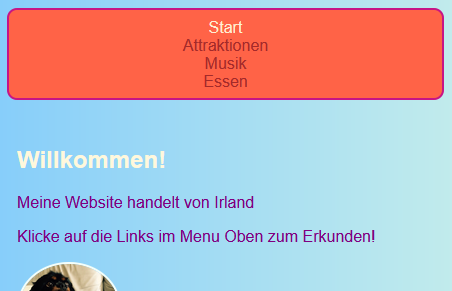

## Lass dein Menu reagieren

Eine **responsive** (engl.: reagierende) Website passt sich selbst an die Bildschirmgröße an, sodass sie immer gut aussieht, unabhängig davon, ob Du sie auf einem Computer, Mobiltelefon oder Tablet betrachtest. Lass uns dein Menu "responsiv" machen!

Du wirst mit den regulären Styles starten: Das wird Dein **Standard** Verhalten sein.

## \--- collapse \---

## title: Was bedeutet "Standard"?

Die Standard-Stile sind Deine normalen Stilregeln. Sie werden auf jeden Fall angewendet, bevor irgendwelche besonderen Bedingungen geprüft werden.

Du kannst Code hinzufügen, der dann die Größe des Bildschirms überprüft und gegebenenfalls Anpassungen vornimmt.

\--- /collapse \---

+ FügeDeinem Menu die folgenden CSS-Regeln hinzu. Wahrscheinlich hast Du auch Farben und Ränder definiert. Ich habe sie hier weggelassen, um Platz zu sparen! Falls Du bereits CSS-Regeln für dein Menu definiert hast, füge diese hier einfach hinzu oder ändere die Werte entsprechend.

```css
    nav ul {
        padding: 0.5em;
        display: flex;
        flex-direction: column;
    }
    nav ul li {
        text-align: center; 
        list-style-type: none;
        margin-right: 0.5em;
        margin-left: 0.5em;
    }
```

Mit dem obigen CSS-Code ist Dein Menu bestens für kleine Bildschirme geeignet. Dies wird als **Mobile-First** Entwicklung bezeichnet.



## \--- collapse \---

## titel: Was bedeutet "Mobile-First"?

Du wirst sehr oft beim Programmieren einer Website einen Computerbildschirm verwenden und wahrscheinlich wirst Du Stile definieren, die darauf basieren wie sie auf diesem Bildschirm aussieht.

Wenn Du zuerst (engl.: first) für Mobilgeräte programmierst, wählst Du stattdessen Standardstile, die für kleine Bildschirme wie Smartphones geeignet sind. Du fügst dann Code hinzu um Anpassungen für größere Bildschirme zu machen.

Da immer mehr Menschen auf ihren Smartphones oder Tablets im Internet surfen und nicht auf einem Computer, empfiehlt es sich deine Website in diesem Sinne zu entwickeln.

\--- /collapse \---

+ Füge jetzt den folgenden Code zu deinem Stylesheet hinzu:

```css
    @media all and (min-width: 1000px) {
        nav ul {
            flex-direction: row;
            justify-content: space-around;
        }
    }
```

Die erste Zeile des Codes oben überprüft die Größe des Browserfensters. Wenn das Fenster **1000 Pixel** oder mehr breit ist, werden alle Stilregeln innerhalb des Blocks angewendet.


## \--- collapse \---

## title: Wie funktioniert das?

Der Block enthält nur für einige Eigenschaften des `nav ul` Menus neue Werte.

Immer wenn das Fenster größer als 1000 Pixel ist, werden diese neuen Werte angewendet, anstelle der Werte die Du bereits für `nav ul` definiert hast.

Die übrigen Eigenschaften, die Du zuvor für `nav ul` definiert hast, bleiben unverändert.

\--- /collapse \---

+ Wenn du Trinket zum Schreiben von Code verwendest, ist es vielleicht hilfreich das Projekt herunterzuladen, damit Du es auf dem gesamten Bildschirm testen kannst.

\--- challenge \---

## Herausforderung: Lass sich dein Menu selbstständig an große Bildschirme anpassen

+ Kannst du einen weiteren Block, mit `flex-end` anstelle von `space-around`, für Bildschirme, die größer als **1600 Pixel** sind, hinzufügen?


\--- hints \---

\--- hint \---

Der folgende Code definiert die Flex-Eigenschaften für Menüelemente, wenn der Bildschirm größer als 1600 Pixel ist:

```css
    @media all and (min-width: 1600px) {
        nav ul {
            flex-direction: row;
            justify-content: flex-end;
        }
    }  
```

\--- /hint \---

\--- /hints \---

\--- /challenge \---

Du kannst jede beliebige CSS-Regel in solche Blöcke einfügen, um unterschiedliche Stile für verschiedene Bildschirmgrößen zu definieren. Das ist besonders nützlich, wenn Du später CSS-Grid-Layouts (Grid engl. für Raster) erstellest!