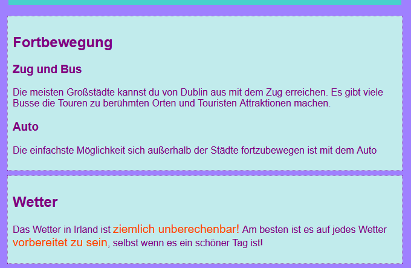

## Bildunterschriften und Randnotizen

Auf dieser Karte wirst du zwei weitere **Container**-Elemente kennen lernen: Eines das Du verwenden kannst, um Beschriftungen (also Text, wie eine Überschrift oder eine kurze Beschreibung) zu einem Bild hinzuzufügen und ein Anderes für den Fall, dass du zusätzliche Dinge hast, das nicht wirklich zu den Haupt-Informationen auf der Seite gehört.

### Bilder mit Bildunterschriften

+ Finde ein `img` Element, bei dem Du Text oberhalb oder unterhalb hast, welcher zum Bild dazu gehört. Ich arbeite mit dem Tito Bild auf `index.html`, aber Du kannst mit allem arbeiten, was Du auf Deiner Website hast. 

```html
            
  <p>
    Reiseführer Tito!
  </p>
```

+ Füge in der Zeile über dem Code das öffnende `<figure>`-Tag ein. Platziere das schließende `</figure>`-Tag in einer neuen Zeile unterhalb des Codes.

+ Entferne als Nächstes die `p`-Tags oder welche Tags auch immer du um den Text herum hast (vielleicht ist es auch eine Überschrift wie `h2`?) und packe den Text stattdessen zwischen `<figcaption></figcaption>`-Tags. Das Ganze sollte ungefähr so aussehen:

```html
  <figure>
                
      <figcaption>
      Reiseleiter Tito!
      </figcaption>
  </figure>
```

Das `figcaption` Element ist Deine **Beschriftung**. Es kann entweder über dem `img` Element oder darunter stehen.


--- collapse ---
---
title: Warum ist das nützlich?
---

Das `figure` Element fungiert als eine Art **Container** für das Bild und die Beschriftung. Auf diese Weise kannst Du sie bei der Definition von Stilen als eine Einheit behandeln.

Eine logische Gruppierung hilft auch dabei, eine gute Struktur in deinem Website-Code beizubehalten.

--- /collapse ---

Du kannst `figure` und `figcaption`, wie jedes andere Element auch, mit CSS-Code, mit Hilfe von Klassen, IDs oder Elementselektoren, gestalten. Ich füge die folgenden Regeln hinzu, um den zusätzlichen Abstand zu entfernen, der durch den neuen Container hinzugefügt wurde:

```css
  figure { 
      margin-top: 0px;
      margin-bottom: 0px;
      margin-left: 0px;
      margin-right: 0px;
  }
```

### Randnotizen

Die Attraktionen-Seite auf meiner Website ist eine Liste von Orten, die einen Besuch wert sind. Ich möchte einige Anmerkungen zum Wetter und zur Fortbewegung hinzufügen. Diese Informationen gehören nicht wirklich in das `article` Element mit allen Attraktionen. Dies ist ein Beispiel dafür, wann Du das `aside` Element verwenden kannst.

+ Geh zu einer Seite Deiner Website, auf der sich ein `article` Element befindet. Ich verwende `attractions.html`.

+ **Außerhalb** des `article` Elements, fügst Du ein oder mehrere Paare von `<aside> </aside>` Tags hinzu, die deine Zusatzinformationen enthalten.

```html
  <aside class="sideNoteStyle">
      <h2>Fortbewegung</h2>
      <h3>Zug und Bus</h3>
      <p>Die meisten größeren Städte kannst Du mit dem Zug von Dublin aus erreichen. Es gibt viele Busse, die Touren zu beliebten Orten und Sehenswürdigkeiten anbieten.</p>
      <h3>Auto</h3>
      <p>Außerhalb der Städte kannst Du Dich am einfachsten mit dem Auto fortbewegen.</p>
    </aside>
    <aside class="sideNoteStyle">
      <h2>Wetter</h2>
      <p>Das Wetter in Irland ist <span class="specialText"> sehr unvorhersehbar! </span> Am besten ist es, wenn man auf jedes Wetter <span class="specialText">vorbereitet ist</span>, selbst an einem schönen Tag!</p>
  </aside>
```

--- collapse ---
---
title: Warum ist das nützlich?
---

Die `aside`, `article` und andere Container sind alle ähnlich. Der einzige wirkliche Unterschied ist in der **Bedeutung**, also wofür Du sie verwendest.

Es ist wichtig, aussagekräftige HTML-Elemente zu verwenden, wann immer Du kannst. Es gibt Deiner Website eine bessere Struktur und ist besonders hilfreich für Benutzer, die **Screenreader** verwenden.

--- /collapse ---

Hast du das andere Element dort gefunden, `span`? Dies ist ein spezielles Tag, mit dem Du einfach nur zusätzlichen CSS-Code hinzufügen kannst! Du kannst alles zwischen ein `span`-Tags setzen. Das ist nützlich, um zum Beispiel nur einen **Teil** des Textes in einem Absatz zu formatieren.

+ Füge Deinem Stylesheet den folgenden CSS-Code hinzu, um das Styling für den obigen HTML-Code zu vervollständigen.

```css
  .sideNoteStyle {
    border: dotted 1px purple;
    background-color: #c1ebec;
    padding: 0.5em;
    margin: 0.5em;
  }
  .specialText {
      color: #FF4500;
      font-size: larger;
  }
```



Auf der nächsten Karte wirst du lernen, wie du das Layout deiner Website interessanter machen kannst!

+ Erstelle zur Vorbereitung eine Seite mit einem `article`- und zwei `aside`-Elementen zwischen den `<main> </main>` Tags. Oder wenn Du willst, kannst Du mit der Attraktionen-Seite auf meiner Website arbeiten.