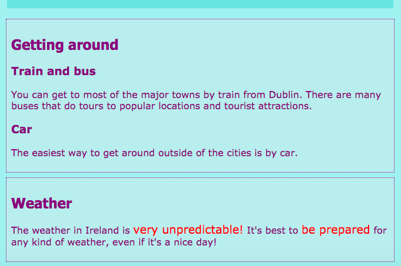

## Sidenotes and captions

On this card you'll learn about two more types of **container** element, one that you can use to add a caption (that is, some text like a title or short description) to a picture, and another for when you have extra stuff that doesn't really belong with the main information on a page. 

### Pictures with captions

+ Find an `img` element where you have text above or below that goes with the picture. I'm working with the Tito picture on `index.html`, but you can go with whatever is on your website.  

```html
    		
  <p>
    Tour guide Tito!
  </p>
```

+ On the line above the code, add the tag `<figure>`. Place the closing tag `<\figure>` on a new line after the code.

+ Next, remove the `p` tags, or whatever tags you have around the text \(maybe it's a heading, like `h2`?\) and put the text in between `<figcaption> <\figcaption>` tags instead. The whole thing should look something like this:

```html
  <figure>
        		
      <figcaption>
      Tour guide Tito!
      </figcaption>
  </figure>
```
   
The `figcaption` element is your `caption`. It can go either above the `img` element or below it.


--- collapse ---
---
title: Why is this useful?
---

The `figure` element acts as a sort of **container** for your picture and its caption. 

This allows you to treat them as one unit when defining styles.

Grouping them together logically also helps to maintain a good structure to your website.

--- /collapse ---

You can use CSS to style `figure` and `figcaption` as you would any other element using classes, IDs, or element selectors. I'm adding the following rules to remove the extra spacing that was added by the new container:

```css
  figure { 
      margin-top: 0px;
      margin-bottom: 0px;
      margin-left: 0px;
      margin-right: 0px;
  }
```

### Side notes

The Attractions page on my website is a list of places to visit. I want to add some notes about weather and how to get around. That information doesn't really belong in the `article` element with all the attractions. This is an example of when you might use the `aside` element.

+ Go to a page of your website that has an `article` element on it – I'm using `attractions.html`. 

+ **Outside** of the `article` element, add one or more pairs of `<aside> <\aside>` tags containing your extra stuff.

```html  
  <aside class="sideNoteStyle">
      <h2>Getting around</h2>
      <h3>Train and bus</h3>
      <p>You can get to most of the major towns by train from Dublin. There are many buses that do tours to popular locations and tourist attractions.</p>
      <h3>Car</h3>
      <p>The easiest way to get around outside of the cities is by car.</p>
    </aside>
    <aside class="sideNoteStyle">
      <h2>Weather</h2>
      <p>The weather in Ireland is <span class="specialText">very unpredictable!</span> It's best to <span class="specialText">be prepared</span> for any kind of weather, even if it's a nice day!</p>
  </aside>
```

--- collapse ---
---
title: Why is this useful?
---

The `aside`, `article` and other containers are similar. The only real difference is in the **meaning**, that is, what you use them for. 

It's important to use meaningful HTML elements whenever you can. It gives your website better structure and is especially helpful for people using **screen readers**.
  
--- /collapse ---

Did you spot the bonus element in there, `span`? It's a special tag you can use just for adding extra CSS! You can put anything in between a pair of `span` tags. It's useful for things like styling a **part** of the text in a paragraph.

+ Add the following CSS code to your stylesheet to complete the styling for the HTML code above.

```css
  .sideNoteStyle {
    border: dotted 1px purple;
    background-color: #c1ebec;
    padding: 0.5em;
    margin: 0.5em;
  }
  .specialText {
      color: #FF4500;
      font-size: larger;
  }
```



On the next card you're going to learn how to make the layout more interesting! 

+ To get ready, make a page that has one `article` and two `aside` elements inside the `<main> </main>` tags. Or if you prefer, you can work with the Attractions page on my website.

   