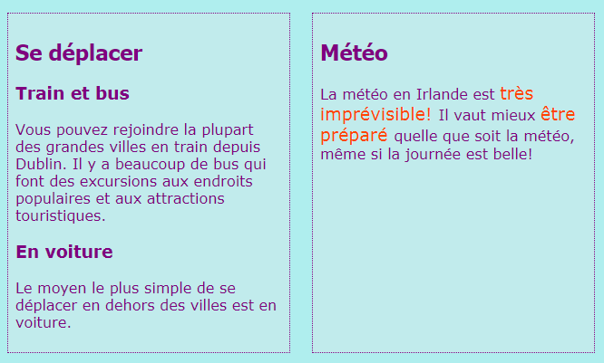
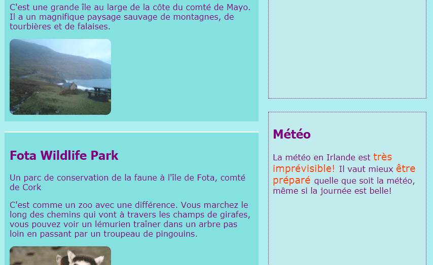
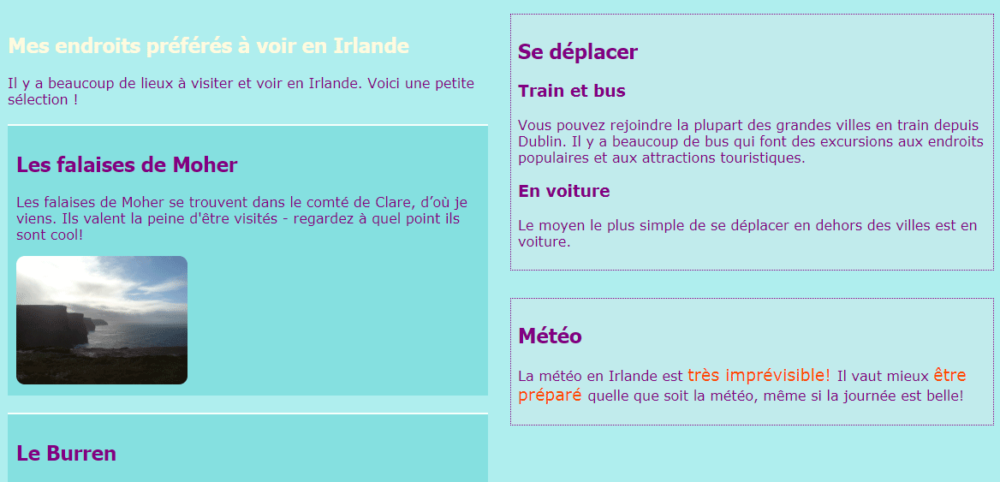

## Concevoir une belle mise en page

+ Pour cette carte, tu devras travailler avec une page contenant un élément `main` avec trois éléments à l'intérieur: un `article` et deux `aside`. Vas-y et crée-les d'abord si tu en as besoin. Si tu veux travailler avec mon site web, ajoute le code `aside` de la carte sushi précédente à la page Attractions. 

Voici trois mises en page différentes que tu appliqueras:


+ Ajoute de nouvelles classes CSS à `main` et chacun des trois éléments à l'intérieur.

```html
    <main class="attPageLayoutGrid">
        <article class="attGridArticle">
            <!--autre truc ici-->
        </article>
        <aside class="attGridAside1">
            <!--autre truc ici-->
        </aside>
        <aside class="attGridAside2">
            <!--autre truc ici-->
        </aside>
    </main>
```

Le conteneur dont tu modifieras la présentation est `main`, mais tu pourrais le faire avec n’importe quel type de conteneur, comme un `div` ou `article`, ou même la totalité de la page `body`. La technique que tu vas utiliser s'appelle **CSS grid**.

Dans cet exemple, `header` et `footer` seront laissés en dehors de la conception, mais il est assez courant de les inclure également dans la grille.

+ Définir la propriété `display` à `grid` sur le conteneur global:

```css
    .attPageLayoutGrid {
        display: grid;
        grid-column-gap: 0.5em;
        grid-row-gap: 1em;
    }
```

Que penses-tu que les propriétés `grid-column-gap` et `gap-row-gap` font?

+ Ensuite, tu nommes un `grid-area` pour chaque élément: 

```css
    .attGridArticle {
        grid-area: agArticle;
    }
    .attGridAside1 {
        grid-area: agAside1;
    }
    .attGridAside2 {
        grid-area: agAside2;
    }
```

Ensuite, tu conçois ta mise en page! Mettons les deux éléments `aside` côte à côte au bas de la page. Pour cela, tu as besoin de deux **colonnes** de largeur égale. Tu peux conserver la hauteur automatique **row**.

+ Place le code suivant dans les règles CSS `.attPageLayoutGrid`:

```css
    grid-template-rows: auto;
    grid-template-columns: 1fr 1fr;
    grid-template-areas: 
        "agArticle agArticle"
        "agAside1 agAside2";
```

`fr` représente **fraction**. Remarque comment tu fais l'`article` occuper tout l'espace sur les deux colonnes.

--- collapse ---
---
title: À l'aide! J'ai des erreurs et des avertissements!
---

Si tu utilises Trinket, tu remarqueras peut-être des erreurs et des avertissements apparaître, même si tu as tapé le code exactement comme ci-dessus. C'est parce que Trinket ne reconnaît pas encore les propriétés de la grille CSS. Cependant, le code fonctionnera toujours.

Si le code de grille CSS génère des avertissements de «unknown property» ou une erreur du type «unexpected token 1fr», tu peux simplement les ignorer.

--- /collapse ---



Mettons les éléments `aside` sur la droite et les rendre la moitié de la largeur de l'`article`.

+ Change les valeurs de `grid-template-columns` et `grid-template-areas` en:

```css
    grid-template-columns: 2fr 1fr;
    grid-template-areas: 
        "agArticle agAside1"
        "agArticle agAside2";
```



+ Si tu ne veux pas que les éléments `aside` s'étirent jusqu'en bas, tu peux ajouter un espace vide en utilisant un point: 

```css
    grid-template-areas: 
        "agArticle agAside1"
        "agArticle agAside2"
        "agArticle . ";
```



--- challenge ---

## Défi : faire des mises en page différentes pour différentes tailles d'écran

+ Peux-tu utiliser les vérifications de taille d'écran que tu as ajoutées précédemment pour modifier la disposition en fonction de la largeur de l'écran? Remarque: si tu as déjà créé des blocs CSS pour chaque taille d'écran, tu peux ajouter le nouveau code CSS à ces blocs au lieu d'en créer de nouveaux.

--- hints ---


--- hint ---

Le code suivant définit une disposition pour la classe CSS ci-dessus lorsque l'écran est supérieur à 1000 pixels:

```css
    @media all and (min-width: 1000px) {
        .attPageLayoutGrid {
            grid-template-columns: 1fr 1fr;
            grid-template-areas: 
                "agArticle agArticle"
                "agAside1 agAside2";
        }
    }  
```

--- /hint ---

--- hint ---

Le code suivant définit une disposition pour la classe CSS ci-dessus lorsque l'écran est supérieur à 1600 pixels:

```css
    @media all and (min-width: 1600px) {
        .attPageLayoutGrid {
            grid-template-columns: 1fr 1fr;
            grid-template-areas: 
                "agArticle agAside1"
                "agArticle agAside2"
                "agArticle .";
        }
    }  
```

--- /hint ---

--- /hints ---

--- /challenge ---

Avec **CSS grid**, tu peux faire presque n'importe quelle mise en page que tu veux. Si tu veux en apprendre plus, va sur [dojo.soy/html3-css-grid](http://dojo.soy/html3-css-grid){:target="_blank"}