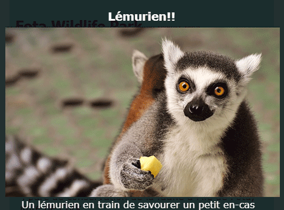

## Effets spéciaux

Sur cette carte, tu apprendras quelques effets supplémentaires que tu peux obtenir avec CSS.

### Ombres et mouvement

Ajoutons un petit mouvement lorsque tu passes ton curseur sur les cartes que tu as créées précédemment.

+ Trouve la classe CSS `.card:hover` précédente et remplace-la par la suivante:

```css
    .card:hover {
        box-shadow: 0px 2px 2px rgba(0,0,0,0.2); 
        transform: translateY(-2px);
    }
```

+ Essaie différentes valeurs dans la fonction `translate`!

--- collapse ---
---
title: La propriété `transform`
---

Si tu as fait les cartes Sushi Intermediate HTML/CSS, tu te souviendras peut-être de la propriété `transform` dans certaines animations `@keyframes`. Tu vois ici que tu peux également utiliser la propriété seule dans un bloc CSS normal.

Un type de valeur que tu peux définir est `rotate`, pour faire tourner un élément. D'autres sont `translateY`, qui déplace quelque chose vers le haut ou le bas, et `translateX`, pour se déplacer d'un côté à l'autre.

--- /collapse ---

+ Joue avec différentes valeurs de pixels dans la propriété `box-shadow` pour voir ce qu'ils font. 

--- collapse ---
---
title: Qu'est-ce que `rgba`?
---

`rgba (0,0,0,0,2)` est une autre façon de définir une couleur.

Il a les trois chiffres habituels (de `0` jusqu'à `255`) pour le rouge, le vert et le bleu.

Le quatrième numéro, appelé la valeur **alpha** valeur, définit la **transparence** de quelque chose. C'est un nombre décimal compris entre `0` et `1` , avec `1` pour ne pas être vu du tout, et `0` pour être complètement invisible. Cela signifie que plus la valeur alpha d'un élément est basse, plus il est transparent.

--- /collapse ---

+ Enfin, adoucis le mouvement en ajoutant la propriété suivante à la classe `.card` de plus tôt: 

```css
    transition: all 0.2s ease-out;
```

Une durée de `0.2s` signifie que la `transition` dure 0,2 secondes.

### Lightbox

Un autre effet que tu as probablement déjà vu sur de nombreux sites Web est la **lightbox**: tu cliques sur quelque chose et le site Web s'assombrit tandis que quelque chose d'autre, comme une image plus grande ou une boîte contextuelle, apparaît devant tout.



Pour obtenir cet effet, tu vas créer deux liens: un pour la lightbox actuelle (le bit qui apparaît) et un pour la chose sur laquelle tu cliques pour faire apparaître la lightbox. Je vais faire le mien sur la page Attractions de mon site. Tu vas avec n'importe quelle page sur laquelle tu as des images!

+ Décide quels éléments tu souhaites afficher lorsque tu cliques dessus et ajoute-les tous à ta page entre un jeu de balises `a` pour faire un lien. Assure-toi de donner au lien un `id`. Le code peut aller n'importe où sur la page: tu rends les éléments invisibles à la prochaine étape!

```html
    <a href="#_" class="lightbox" id="boxLemur">
        <h3>Lémurien!!</h3>
        <2 />
        <p>Un lémurien en train de savourer un petit en-cas</p>
    </a>
```

Tu peux mettre ce que tu veux entre les balises de lien. J'ai une grande image, un titre et du texte. Peut-être que tu veux juste une image et pas de texte!

+ Ajoute le code CSS suivant pour la lightbox. Peux-tu déterminer ce que certaines d'entre elles font?

```css
    .lightbox{
        background: rgba(0,0,0,0.8);
        color: #ffffff;
        text-align: center;
        text-decoration: none;
        width: 100%;
        height: 100%;
        top: 0;
        left: 0;
        position: fixed;
        visibility: hidden;
        z-index: 999;
    }
```

Remarque: Réglage de la propriété `position` à `fixed` signifie que la position que tu définis sera relative à la fenêtre du navigateur, elle restera donc en place lorsque tu fais défiler.

+ Ensuite, décide sur quoi tu veux cliquer pour faire apparaître la lightbox, et ajoute une paire de balises `a` autour de cet élément (dans mon cas, c'est une image plus petite d'un lémurien). Le **target** du lien sera la lightbox, que tu définis en utilisant l'`id`. Tu pourras reconnaître cette technique de tout à l'heure!

```html
    <a href="#boxLemur">
        
    </a>
```

+ Enfin, ajoute le code CSS suivant. Note qu'il s'agit d'une **pseudo-classe**; il devrait aller après le code pour la classe `.lightbox` et pas à l'intérieur!

```css
    .lightbox:target {
        visibility: visible;
    }
```

La pseudo-classe `:target` est appliquée chaque fois que la lightbox était la cible du dernier lien cliqué. Ainsi, lorsque tu cliques n'importe où, le `visibility` sera remis sur `hidden`.

+ Essaie de cliquer sur ton nouveau lien pour voir la lightbox apparaître! Pour le faire disparaître, il suffit de cliquer n'importe où sur la page.

Tu peux ajouter autant de lightbox que tu le souhaites sur une page. Ils peuvent tous utiliser la même classe CSS - assure-toi simplement que chaque classe a un `id` différent ! Pour chacun, tu dois faire quelque chose sur ta page web dans un lien que tu peux cliquer pour faire apparaître la lightbox, puis utilise la valeur `id` comme `href` dans ce lien, comme tu l'as fait ci-dessus!


***
Ce projet a été traduit par des bénévoles:

Jonathan Vannieuwkerke

Michel Arnols

Grâce aux bénévoles, nous pouvons donner aux gens du monde entier la chance d'apprendre dans leur propre langue. Vous pouvez nous aider à atteindre plus de personnes en vous portant volontaire pour la traduction - plus d'informations sur [rpf.io/translate](https://rpf.io/translate).