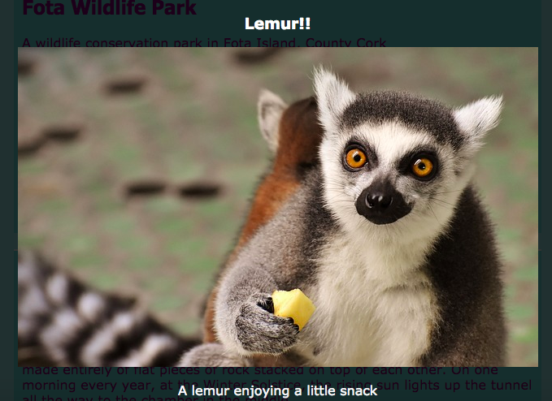

## Effetti speciali

Con questa scheda imparerai alcuni effetti, più belli, che puoi ottenere con il CSS.

### Ombre e movimento

Aggiungiamo un po' di movimento quando passi con il mouse sopra i biglietti che hai creato prima.

+ Trova la classe CSS `.card:hover` di prima e cambiala come segue:

```css
    .card:hover {
        box-shadow: 0px 2px 2px rgba(0,0,0,0.2); 
        transform: translateY(-2px);
    }
```

+ Prova diversi valori nella funzione `translate`!

## \--- collapse \---

## title: La proprietà `transform`

Se hai completato il progetto Intermediate HTML/CSS Sushi Cards, dovresti ricordare come utilizzare la proprietà `transform` in alcune animazioni `@keyframes`. Qui puoi vedere che è possibile anche usare la proprietà da sola, all'interno di un normale blocco CSS.

Un tipo di valore che puoi impostare è `rotate`, per far girare un elemento. Altre sono `translateY`, che sposta qualcosa in alto o in basso, e `translateX`, per il movimento da un lato all'altro.

\--- /collapse \---

+ Gioca con diversi valori di pixel nella proprietà `box-shadow` per vedere cosa fanno. 

## \--- collapse \---

## title: Cos'è `rgba`?

`rgba (0,0,0,0.2)` è un altro modo di definire un colore.

Ha i soliti tre numeri (da `0` fino a `255`) per rosso, verde e blu.

Il quarto numero, chiamato valore **alpha**, definisce la **trasparenza**. È un numero decimale compreso tra `0` e `1`, dove `1` non è trasparente e `0` è completamente invisibile. Ciò significa che più basso è il valore alpha di un elemento, più è trasparente.

\--- /collapse \---

+ Infine, rendi il movimento fluido aggiungendo la seguente proprietà alla classe `.card` di prima: 

```css
    transition: all 0.2s ease-out;
```

Una durata di `0,2 s` significa che la `transition` dura per 0,2 secondi.

### Lightbox

Un altro effetto che probabilmente hai visto su molti siti web è il **lightbox**: fai clic su qualcosa e il sito si oscura, mentre qualcos'altro, come una foto più grande o una finestra popup, appare davanti a tutto.



Per ottenere questo effetto, creerai due link: uno per il lightbox reale (l'oggetto che si apre) e uno per l'elemento sul quale fai clic per far apparire la lightbox. Farò il mio nella pagina delle Attrazioni del mio sito web. Prova con qualunque pagina in cui hai delle foto!

+ Decidi quali cose vuoi far apparire quando fai clic e aggiungile alla tua pagina tra di una serie di tag `a` per creare un collegamento. Assicurati di dare un `id` al link. Il codice può andare ovunque sulla pagina: renderai gli elementi invisibili nel prossimo passo!

```html
    <a href="#_" class="lightbox" id="boxLemur">
<h3>Lemure!!</h3>

<p>Un lemure che si gode un piccolo spuntino</p>
</a>
```

Puoi mettere quello che vuoi tra i tag del link. Ho una grande immagine, un titolo e del testo. Forse vuoi solo una foto e nessun testo!

+ Aggiungi il seguente codice CSS per la lightbox. Sei in grado di capire cosa fanno alcune di queste?

```css
    .lightbox{
        background: rgba(0,0,0,0.8);
        color: #ffffff;
        text-align: center;
        text-decoration: none;
        width: 100%;
        height: 100%;
        top: 0;
        left: 0;
        position: fixed;
        visibility: hidden;
        z-index: 999;
    }
```

Nota: l'impostazione della proprietà `position` su `fixed` indica che la posizione impostata sarà relativa alla finestra del browser, quindi rimarrà fissa durante lo scorrimento.

+ Quindi, decidi su cosa vuoi fare clic per far apparire la lightbox, e aggiungi un paio di tag `a` attorno a quell'elemento (nel mio caso è un'immagine più piccola di un lemure). Il **target** del link sarà la lightbox, che hai impostato usando l'`id`. Potresti riconoscere questa tecnica già usata in precedenza!

```html
    <a href="#boxLemur">
        
    </a>
```

+ Infine aggiungi il seguente codice CSS. Nota che questa è una **pseudo-class**; dovrebbe andare dopo il codice per la classe `.lightbox` e non dentro!

```css
    .lightbox:target {
        visibility: visible;
    }
```

La pseudo-classe `:target` viene applicata ogni volta che la lightbox è stata la destinazione dell'ultimo link su cui è stato fatto clic. Perciò, quando fai clic da qualche parte, la `visibility` sarà impostata su `hidden`.

+ Prova a fare clic sul tuo nuovo link per vedere la lightbox apparire! Per farlo andare via, basta cliccare in qualsiasi punto della pagina.

Puoi aggiungere tutte le lightbox che vuoi a una pagina. Usano tutte la stessa classe CSS - basta assicurarsi che ognuno abbia un `id` diverso! Per ognuno di essi, devi trasformare qualcosa sulla tua pagina web in un link sul quale puoi fare clic per far apparire la lightbox, e quindi utilizzare l'`id` come valore `href` in quel link, proprio come hai fatto sopra!