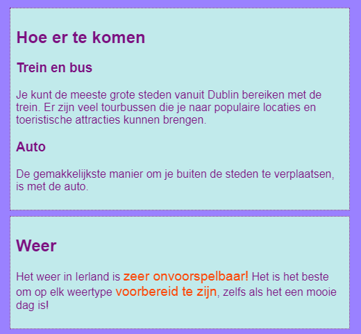

## Onderschriften en kanttekeningen

Op deze kaart leer je meer over twee soorten **container** elementen: een element dat je kunt gebruiken om een ​​bijschrift toe te voegen (een tekst als een titel of een korte beschrijving) aan een foto, en een ander voor wanneer je extra dingen hebt die niet echt bij de hoofdinformatie op een pagina horen.

### Afbeeldingen met bijschriften

+ Zoek een `img` element waar je tekst boven of onder hebt die bij de afbeelding hoort. Ik werk met de Tito-afbeelding op `index.html`, maar je kunt kiezen uit wat er op je website staat. 

```html
            
  <p>
    Tour gids Tito!
  </p>
```

+ Op de regel boven de code, voeg de openings tag `<figure>` toe. On a new line below the code, place the closing tag `</figure>`.

+ Next, remove the `p` tags, or whatever tags you have around the text (maybe it's a heading, like `h2`?), and put the text in between `<figcaption> </figcaption>` tags instead. Het geheel zou er ongeveer zo uit moeten zien:

```html
  <figure>
                
      <figcaption>
      Tour gids Tito!
      </figcaption>
  </figure>
```

Het `figcaption` element is je **bijschrift**. Het kan boven of onder het `img` element komen.


## \--- collapse \---

## title: Waarom is dit handig?

Het element `figure` fungeert als een soort **container** voor je afbeelding en bijschrift. Hiermee kun je ze als één geheel behandelen bij het definiëren van stijlen.

Door ze logisch samen te voegen, helpt het je ook om een ​​goede structuur in je website-code te behouden.

\--- /collapse \---

Je kunt, zoals elk ander element dat klassen, ID's of element selectors gebruikt, CSS-code gebruiken om `figure` en `figcaption` te stijlen. Ik voeg de volgende regels toe om de extra spatiëring te verwijderen die door de nieuwe container is toegevoegd:

```css
  figure { 
      margin-top: 0px;
      margin-bottom: 0px;
      margin-left: 0px;
      margin-right: 0px;
  }
```

### Kanttekeningen

De pagina Attracties op mijn website is een lijst met plaatsen om te bezoeken. Ik wil wat aantekeningen toevoegen over het weer en hoe ik de weg kan vinden. Die informatie hoort niet echt thuis in het `article` element met alle attracties. Dit is een voorbeeld van wanneer je het `aside` element zou kunnen gebruiken.

+ Ga naar een pagina van je website met een `article` element erop - Ik gebruik `attractions.html`.

+ **Outside** of the `article` element, add one or more pairs of `<aside> </aside>` tags containing your extra stuff.

```html
  <aside class="sideNoteStyle">
      <h2>Hoe er te komen</h2>
      <h3>Trein en bus</h3>
      <p>Je kunt de meeste grote steden vanuit Dublin bereiken met de trein. Er zijn veel tourbussen die je naar populaire locaties en toeristische attracties kunnen brengen. </p>
     <h3>Auto</h3> 
     <p>De gemakkelijkste manier om je buiten de steden te verplaatsen, is met de auto.</p>
    </aside>
    <aside class="sideNoteStyle">
       <h2>Weer</h2>
       <p>Het weer in Ierland is <span class="specialText">zeer onvoorspelbaar!</span> Het is het beste om op elk weertype <span class="specialText">voorbereid te zijn</span>, zelfs als het een mooie dag is!</p>
</aside>
```

## \--- collapse \---

## title: Waarom is dit handig?

De `aside`, `article` en andere containers zijn allemaal vergelijkbaar. Het enige echte verschil is de **betekenis**, dat wil zeggen, waarvoor je ze gebruikt.

Het is belangrijk om zinvolle HTML-elementen te gebruiken wanneer je maar kunt. Het geeft je website een betere structuur en is vooral handig voor mensen die **schermlezers** gebruiken.

\--- /collapse \---

Hebt je het andere element daarin gezien, `span`? Dit is een speciale tag die je kunt gebruiken om extra CSS-code toe te voegen! Je kunt van alles tussen een paar `span` tags plaatsen. Het is handig voor dingen zoals het stylen van een **gedeelte** van de tekst in een alinea.

+ Voeg de volgende CSS-code toe aan je style sheet om de stijl voor de bovenstaande HTML-code te voltooien.

```css
  .sideNoteStyle {
    border: dotted 1px purple;
    background-color: #c1ebec;
    padding: 0.5em;
    margin: 0.5em;
  }
  .specialText {
      color: #FF4500;
      font-size: larger;
  }
```



Op de volgende kaart leer je hoe je de layout van je website interessanter kunt maken!

+ Bereid een pagina voor met één `article` en twee `aside` elementen binnen de `<main></main>` tags. Of, als je wilt, kunt je werken met de Attracties pagina op mijn website.